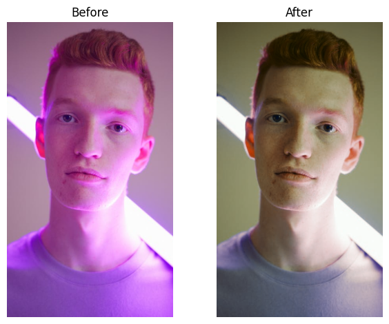

# Latent Space Color Balance

<p align="center">
  
</p>

<br>

This repository contains the code for the [color tweaking algorithm found here](https://messy-bytes.github.io/Advanced-ML-Color-Fixes/), and my [LinkedIn is here](https://www.linkedin.com/in/jack-messerly-567b9b96/) 

## Reassembling the network weights

The Unet used in this project is 103MB, too large for hosting directly on GitHub. Instead, it has been split into two files located in the `checkpoints/` directory. To reassemble the network on Linux systems, run the reassembly script using bash:

```bash
cd checkpoints/
bash reassemble_weights.sh
```

**Note**: This script is intended for use on Linux systems and requires a Linux terminal.

## Setting Up the Environment

Before running the project, set up a Python virtual environment and install the required packages:

```bash
python3 -m venv venv
source venv/bin/activate

pip install -r requirements.txt
```


## Running the Algorithm

To test the algorithm, use `test.py` with the `--image` and `--iterations` flags. Sample images are provided in the `images/` folder.

```bash
python test.py --image images/model.png --iterations 1
```

As discussed in the main project page, the number if iterations is how many times the networks are recursively applied. More applications will generally result in better results, although it does saturate after a few. Often, less is better, although I haven't noticed that it ever truly "diverges", i.e. it is relatively stable. The algorithm will run on your cpu, and each iteration tends to take 3-5 seconds.

For additional images, explore [pexels.com](https://www.pexels.com). I took most of my samples from this website (search bad or mixed colored lighting). You can use the `load_url` function to add new images to the `images/` folder using URLs.

## License

This project is licensed under the MIT License - see the [LICENSE](LICENSE) file for details.

